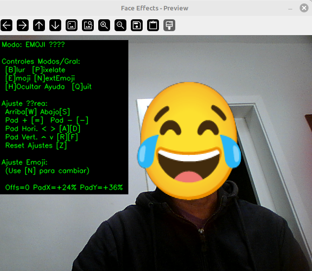
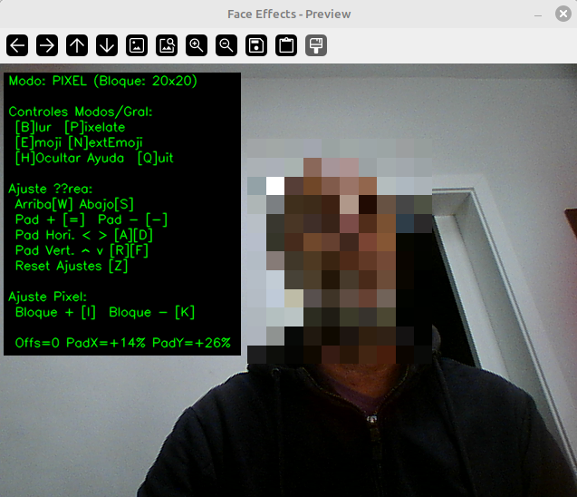

# face-python-fx-virtual-cam 🎭

Aplica efectos faciales en tiempo real (desenfoque, pixelado, emojis) a tu webcam usando Python, MediaPipe y OpenCV, enviando la salida a una cámara virtual. 😜✨

[](https://www.python.org/)
[](https://opensource.org/licenses/MIT)

<!-- TODO: Considera añadir un GIF o captura de pantalla aquí mostrando los efectos -->
<p align="center"></p>

## 🚀 Características

*   **Detección Facial en Tiempo Real:** Con [MediaPipe Face Detection](https://developers.google.com/mediapipe/solutions/vision/face_detector).
*   **Múltiples Efectos:** Blur 🌫️, Pixelate 👾, Emoji Overlay 😂.
*   **Salida a Cámara Virtual:** Usa [pyvirtualcam](https://github.com/letmaik/pyvirtualcam) a `/dev/videoX` 📹.
*   **Controles Interactivos:** Cambia modos y ajusta parámetros al vuelo ⌨️.
*   **Ajuste Fino:** Padding, offset vertical, tamaño de pixelado 🔧.
*   **Configurable:** Opciones de línea de comandos.

<p align="center"></p>

## 🐧 Instalación (Linux Mint / Ubuntu / Debian-based)

Sigue estos pasos para poner en marcha el proyecto:

**1. Prerrequisitos del Sistema:**

*   **Python 3:** v3.8+ y pip (`python3 --version`, `pip3 --version`).
*   **Git:** Para clonar (`sudo apt update && sudo apt install git -y`).
*   **wget:** Para descargar la fuente (`sudo apt install wget -y`).
*   **Herramientas de Compilación:** (`sudo apt install build-essential python3-dev -y`).
*   **v4l2loopback:** Para cámaras virtuales (`sudo apt install v4l2loopback-dkms -y`).
    *   **Importante:** Carga el módulo **con `exclusive_caps=1`**:
        ```bash
        # Elige un video_nr libre (e.g., 10) para --vcam-id
        sudo modprobe -r v4l2loopback # Descarga si ya estaba cargado
        sudo modprobe v4l2loopback devices=1 video_nr=10 card_label="VCamFaceFX" exclusive_caps=1
        ```
        *   Verifica con `ls /dev/video*`.

**2. Clonar el Repositorio:**

```bash
git clone https://github.com/soyunomas/face-python-fx-virtual-cam.git
cd face-python-fx-virtual-cam
```

**3. Descargar Fuente Emoji (Noto Color Emoji):**

El modo Emoji requiere la fuente `NotoColorEmoji.ttf`. Descárgala desde el repositorio oficial de Google Fonts usando `wget`. Esta fuente se distribuye bajo la licencia [SIL OFL 1.1](https://scripts.sil.org/OFL).

```bash
wget -O NotoColorEmoji.ttf https://raw.githubusercontent.com/googlefonts/noto-emoji/main/fonts/NotoColorEmoji.ttf
```
*   Esto descargará la fuente como `NotoColorEmoji.ttf` en el directorio actual.

**4. Configurar Entorno Virtual Python (`venv`):**

```bash
python3 -m venv venv
source venv/bin/activate
# Tu prompt debería cambiar a (venv) $...
```

**5. Instalar Dependencias de Python:**

Asegúrate de que tu entorno virtual esté **activado**. Crea un archivo llamado `requirements.txt` con el siguiente contenido:

```text
# requirements.txt
opencv-python
mediapipe
numpy
pyvirtualcam
Pillow
```

Luego, instala las dependencias:

```bash
pip install -r requirements.txt
```

¡Listo! 🎉 Ya deberías tener todo configurado.

## ▶️ Uso

1.  **Asegúrate** de que `v4l2loopback` esté cargado (paso 1).
2.  **Activa** tu entorno virtual: `source venv/bin/activate`.
3.  **Asegúrate** de que `NotoColorEmoji.ttf` (descargada en el paso 3) esté en el directorio actual, o usa `--font-path` para indicar su ubicación.
4.  **Ejecuta el script:**

    ```bash
    python face_blur_webcam.py [OPCIONES]
    ```

**Opciones Comunes:**

*   `--webcam-id ID`: Cámara física (e.g., `0`).
*   `--vcam-id ID`: Cámara virtual creada (e.g., `10`).
*   `--font-path RUTA`: Ruta a `NotoColorEmoji.ttf` (por defecto: `./NotoColorEmoji.ttf`).
*   `--start-mode MODO`: `blur` (defecto), `pixel`, `emoji`.
*   `--start-pixel-size N`: Tamaño bloque pixelado (e.g., `8`).
*   `--mirror`: Refleja la salida.
*   `--print-fps`: Muestra FPS en consola.
*   `--help`: Muestra todas las opciones.

**Ejemplo:**

```bash
# Usar cámara 0, vcam 10, empezar en modo emoji (fuente en dir actual)
python face_blur_webcam.py --webcam-id 0 --vcam-id 10 --start-mode emoji
```

*   Se abrirá una ventana de OpenCV.
*   Selecciona la cámara "VCamFaceFX" en tu app de videollamada/streaming.

## ⌨️ Controles (Ventana de OpenCV activa)

*   **[Q]**: Salir.
*   **[H]**: Mostrar/Ocultar ayuda.
*   **[B]**: Modo **B**lur.
*   **[P]**: Modo **P**ixelate.
*   **[E]**: Modo **E**moji.
*   **[N]**: Siguiente emoji.
*   **[W/S]**: Mover área Arriba/Abajo.
*   **[A/D]**: Padding Horizontal (-/+).
*   **[R/F]**: Padding Vertical (-/+).
*   **[=]/[+]**: Padding General (+).
*   **[-]**: Padding General (-).
*   **[I/K]**: Tamaño Bloque Pixelado (+/-).
*   **[Z]**: Resetear Ajustes.

## ⚠️ Solución de Problemas Comunes

*   **Error `RuntimeError: ... not a video output device` / `Device or resource busy`:** Carga `v4l2loopback` con `exclusive_caps=1` (Paso 1). Puede que necesites descargar (`sudo modprobe -r v4l2loopback`) y recargar.
*   **Cámara virtual no aparece:** Verifica `ls /dev/video*`, `exclusive_caps=1`, reinicia la app destino.
*   **Modo Emoji no funciona:** Confirma que descargaste `NotoColorEmoji.ttf` correctamente (Paso 3) y que `Pillow` está instalado (`pip show Pillow` en `venv`). Verifica el tamaño del archivo descargado.
*   **Error `wget: command not found`:** Instala wget: `sudo apt install wget`.
*   **Bajo rendimiento (FPS bajos):** Cierra apps pesadas, considera usar menor resolución de webcam.
*   **Error `ImportError: No module named 'cv2'`:** Asegúrate de **activar** `venv` (`source venv/bin/activate`) **antes** de ejecutar `pip install` y `python face_blur_webcam.py`.

## 📜 Licencia

*   **Código del Proyecto:** Este proyecto se distribuye bajo la **Licencia MIT**. Consulta el archivo `LICENSE` para más detalles.
*   **Dependencias:** Este proyecto utiliza bibliotecas de terceros (`opencv-python`, `mediapipe`, `numpy`, `pyvirtualcam`, `Pillow`), cada una con sus propias licencias.
*   **Fuente Emoji:** El script utiliza la fuente [Noto Color Emoji](https://github.com/googlefonts/noto-emoji) de Google, que se descarga por separado (ver sección de Instalación) y está licenciada bajo la [SIL OFL 1.1](https://scripts.sil.org/OFL).
